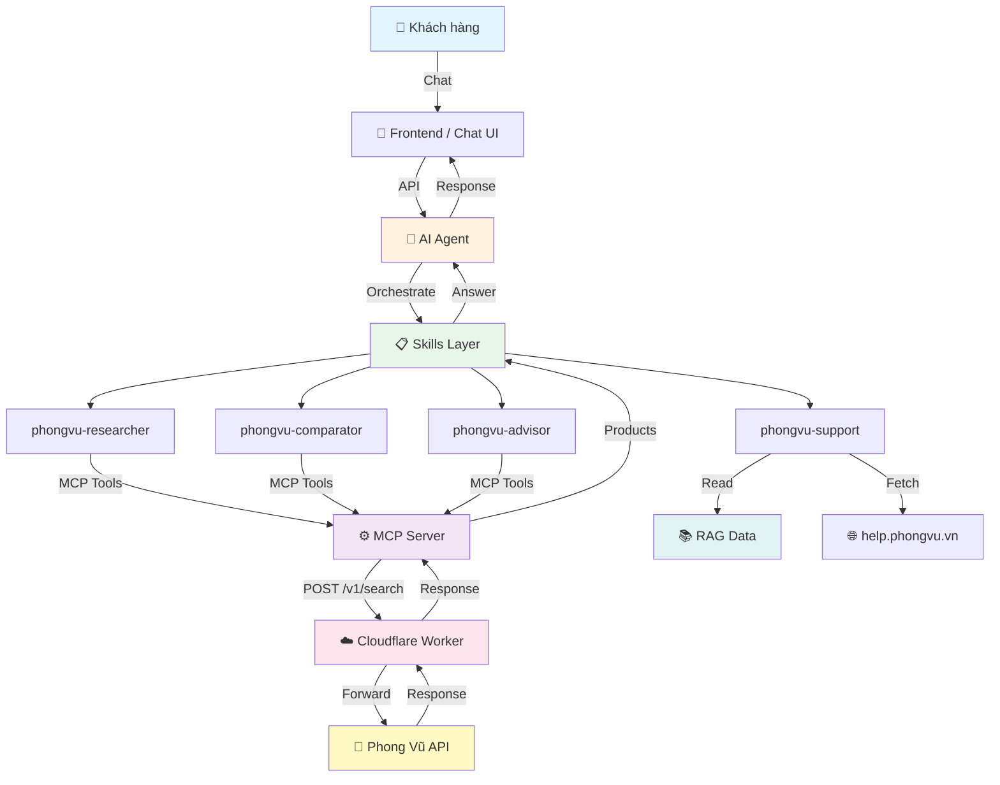
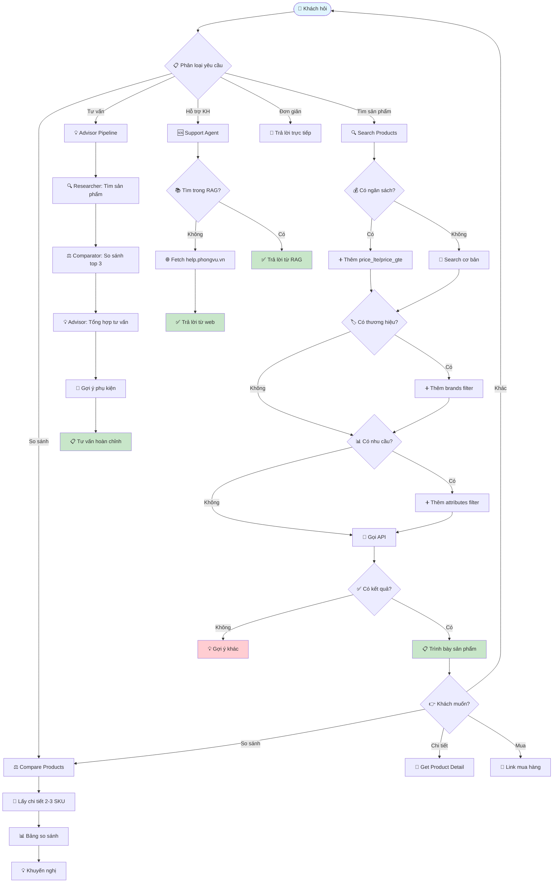
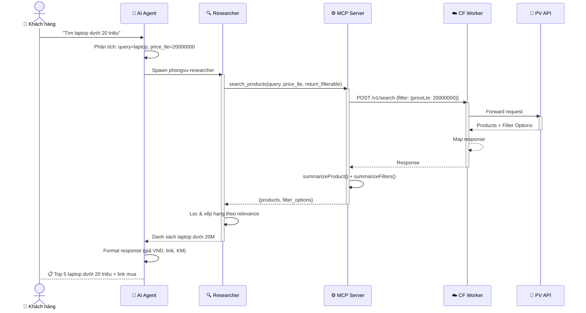
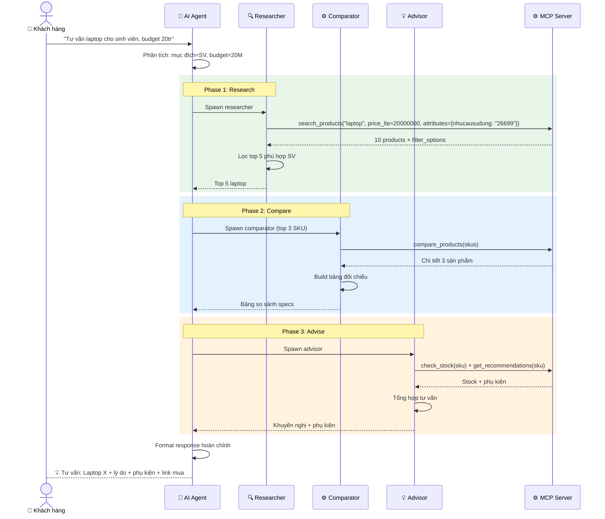
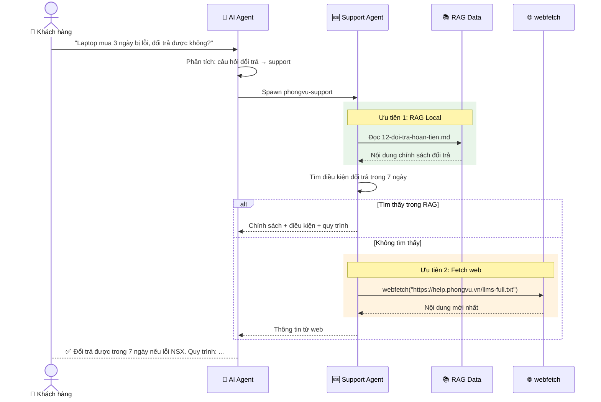
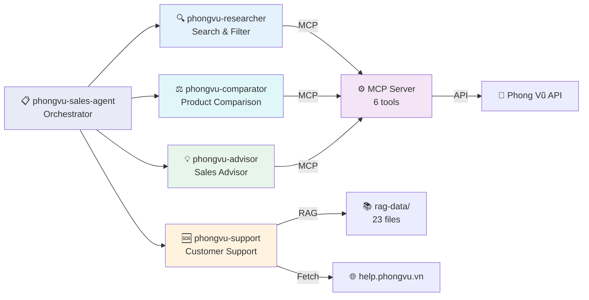

# Phong Vũ AI Sales Agent

AI-powered conversational sales agent for Phong Vũ e-commerce. Compatible with Vercel AI SDK.

## System Architecture



## Business Flow



## Sequence Diagram: Tìm kiếm sản phẩm



## Sequence Diagram: Tư vấn mua hàng (Full Pipeline)



## Sequence Diagram: Hỗ trợ khách hàng (Support)



## Skill Structure



## MCP Tools

| Tool | Description | Input |
| --- | --- | --- |
| `search_products` | Tìm kiếm + filter (price, brand, attributes, sort) | `{ query, page?, limit?, price_lte?, price_gte?, has_promotions?, brands?, attributes?, sort?, order?, return_filterable? }` |
| `get_product_detail` | Chi tiết sản phẩm | `{ sku }` |
| `compare_products` | So sánh 2-3 sản phẩm | `{ skus: [sku1, sku2] }` |
| `get_popular_keywords` | Từ khóa phổ biến | `{ limit? }` |
| `get_recommendations` | Sản phẩm gợi ý | `{ sku }` |
| `check_stock` | Kiểm tra tồn kho & KM | `{ sku }` |

## Project Structure

```text
phongvu-ai-agent/
├── README.md
├── .mcp.json                              # MCP config
├── cloudflare-worker/                     # API Proxy (Cloudflare Worker)
│   └── src/worker.js
├── mcp-server/                            # MCP Server (Node.js)
│   └── index.js                           # 6 tools: search, detail, compare, ...
├── rag-data/                              # RAG data (23 files from help.phongvu.vn)
│   ├── phongvu-help-full.md               # Full content (1824 lines)
│   ├── 01-gioi-thieu.md ~ 23-tuyen-dung.md
│   └── README.md
└── skills/
    └── phongvu-sales-agent/
        ├── SKILL.md                       # Main orchestrator
        ├── references/api.md              # API reference
        ├── scripts/                       # Download scripts
        ├── phongvu-researcher/            # Search & filter
        │   └── SKILL.md
        ├── phongvu-comparator/            # Product comparison
        │   └── SKILL.md
        ├── phongvu-advisor/               # Sales advisor
        │   └── SKILL.md
        └── phongvu-support/               # Customer support
            ├── SKILL.md
            ├── references/rag-data-guide.md
            └── scripts/fetch-help.ts
```

## Quick Start

### 1. Deploy Cloudflare Worker

```bash
cd cloudflare-worker
npm install
wrangler deploy
wrangler secret put PHONGVU_API_BASE
```

### 2. Run MCP Server

```bash
cd mcp-server
npm install
npm start
```

### 3. Update RAG Data

```bash
cd skills/phongvu-sales-agent/phongvu-support
npx tsx scripts/fetch-help.ts --all
```

### 4. Vercel AI SDK Integration

```typescript
import { streamText, tool, isStepCount } from "ai";
import { openai } from "@ai-sdk/openai";
import { z } from "zod";

const tools = {
  search_products: tool({
    description: "Tìm kiếm sản phẩm Phong Vũ",
    inputSchema: z.object({
      query: z.string(),
      price_lte: z.number().optional(),
      brands: z.array(z.string()).optional(),
    }),
    execute: async ({ query, price_lte, brands }) => {
      const filter = {};
      if (price_lte) filter.priceLte = price_lte;
      if (brands?.length) filter.brands = brands;

      const res = await fetch("https://phongvu-api-proxy.tannhatcms.io.vn/v1/search", {
        method: "POST",
        headers: { "Content-Type": "application/json" },
        body: JSON.stringify({ query, terminalCode: "phongvu", filter }),
      });
      return res.json();
    },
  }),
};

const result = streamText({
  model: openai("gpt-4o-mini"),
  system: "Bạn là trợ lý bán hàng AI của Phong Vũ...",
  messages: [{ role: "user", content: "Tìm laptop gaming dưới 20 triệu" }],
  tools,
  stopWhen: isStepCount(5),
});
```

## Security

- **Hide API gốc**: Client chỉ biết domain worker
- **Fake Headers**: Giả vờ từ phongvu.vn khi gọi upstream
- **Rate Limiting**: Giới hạn request/phút per IP
- **Endpoint Whitelist**: Chỉ cho phép các endpoint hợp lệ

## Expected Outcomes

- **+15-20%** conversion rate increase
- **-20%** customer drop-off during discovery
- **40%** offload basic product inquiries

## Key Features

1. **Real-time data** - Live price, stock, promotions
2. **Product comparison** - Side-by-side specs
3. **Smart recommendations** - Budget-aware suggestions
4. **Vietnamese language** - Native support
5. **Direct checkout links** - Guide to purchase
6. **API Security** - Cloudflare Worker proxy
7. **Customer support** - RAG-based FAQ from help.phongvu.vn
8. **Filter system** - Price, brand, attributes, sort
